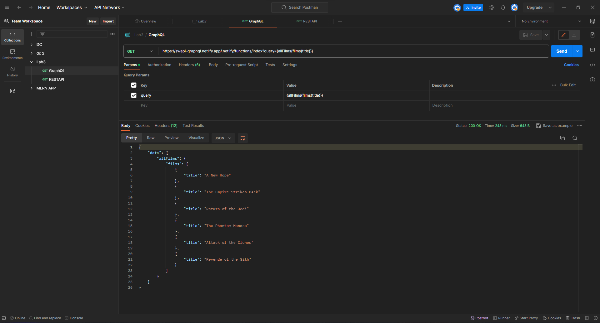
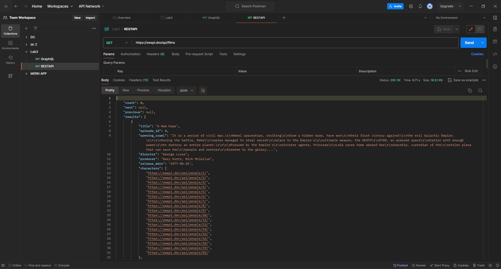

# The Difference between GraphQL and REST API

## Done by: Lathindu Vidanagama

This repository explores and highlights the distinctions between GraphQL and REST API, offering insights into their respective strengths and use cases.

### GraphQL

GraphQL is a query language for APIs, designed to request only the specific data needed, optimizing efficiency and reducing over-fetching.

### REST API

REST API relies on a fixed set of endpoints, delivering JSON data that can sometimes be cluttered and result in over-fetching.